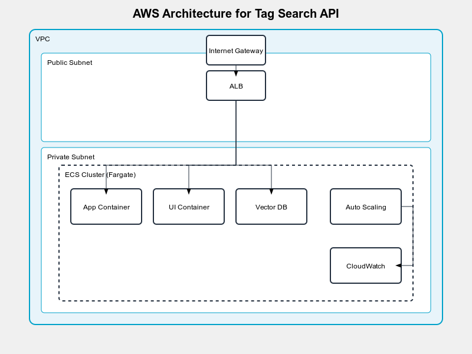

### Code Optimization / Solution optimizations

1. Asynchronous Processing:
    - I only tested asynchronous processing of generating vector embeddings, did not put it 'to production'. Processing time for the embedding generation can be improved with multithreading. 
2. Catching Layer:
    - Caching can be added (Redis) to store frequently queried words. This can reduce the load on the vector database.
3. Code improvements:
    - Significant improvements can be made in `app.py`. Rightn now all the complex logic (synonym search) and the API endpoint handling is is app.py. It would be nicer to add an extra aggregator layer that manages the complex business logic. This class would be called inside the different API endpoints, hiding the business logic.
    - In this aggregator class we should add extra logging (info and debug)
    - There are code duplicates in `ui.py` and `app.py`, where only an URL is the difference between two functions, for exmaple: `check_synonym_task_status()` and `check_task_status()` - this can be improved.

### Maintanance imporvements
 - Automated testing (unit, integration, end-2-end)
 - Code analysis with SonarQube
 - Setup CI to run tests automatically on each commit
 - Add more documentation
 - Increase obserbavility with Grafana

### Deployment strategies / Arcitecture
We need a strategy to allow for efficient scaling, we need to handle increasing loads and manage sessions across multiple instances. AWS would be suitable for all these needs.

The Virtal Private Cloud contains all the resources.  
The public subnet contains the internet gateway the Application Load Balancer.  
The private subnet contains the ECS Cluster (docker containers), Auto sclaing (containers can be scaled horzontally) and CloudWatch for monitoring.  
Traffic from the internet browsers goes through the internet gateway and ABL. ABL distributes traffic to the appropriate containers in the ECS Clusters. (number of containers depends on the active users)